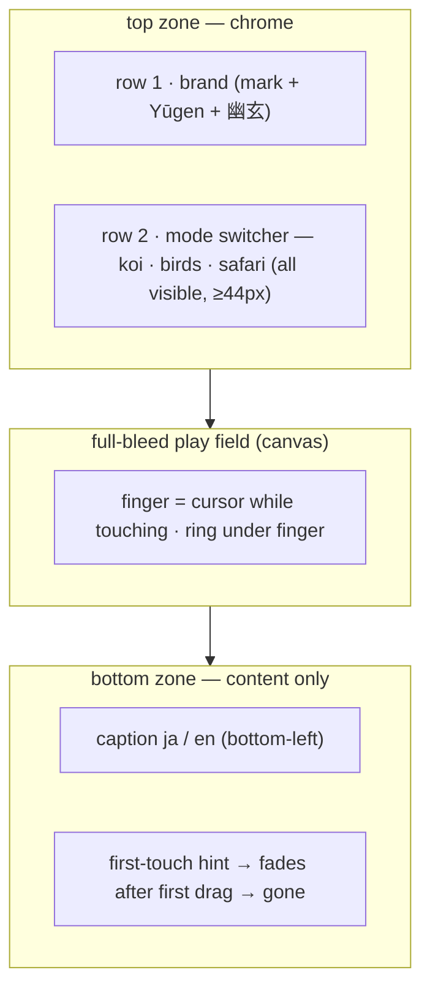
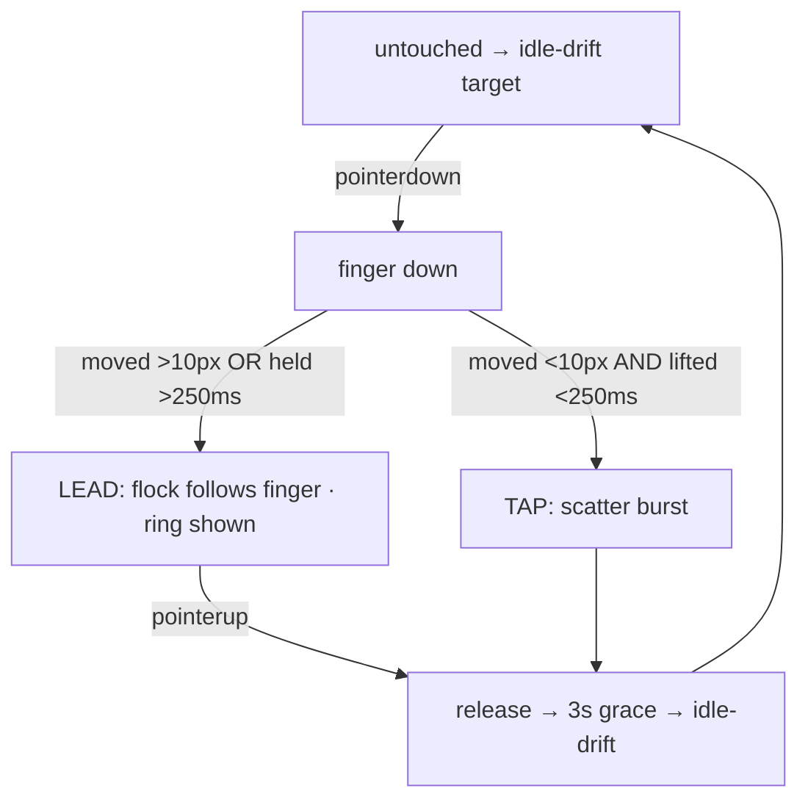
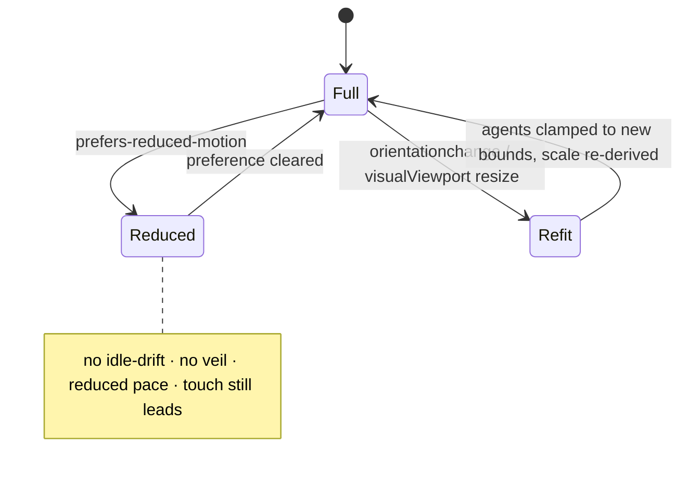

# Interface brief — Ink Flock on mobile & tablet

> Op1 deliverable (`interface-ten-star`, audit → derive). Build-ready, aesthetic-agnostic.
> Decides form + behaviour, not colour/type/copy. 2026-07-16.

## 1. Intent

An ambient, meditative interactive art piece (Yūgen 幽玄 — subtle, profound grace). The
surface exists to make one person *feel a quiet sense of agency and beauty*: they move, the
flock follows; they disturb it, it scatters. The chrome is a whisper; the flock is the work.
On touch, that felt agency must survive the loss of hover — **this is the whole risk of the
port.**

## 2. Archetype decomposition

| Job | Where | Weight |
|-----|-------|--------|
| **Play / ambient-experience** (no corpus archetype — games-adjacent; reason from method) | the canvas + the touch gesture | **primary** — lives or dies here |
| `navigate-and-wayfind` | 3-scene mode switcher (koi / birds / safari) | secondary |
| `onboard-and-learn` | the hint that teaches the one gesture | secondary |
| `recover-and-handle-edges` | reduced-motion, orientation, tiny viewports | cross-cutting |

## 3. Thesis

**A calm full-bleed instrument you play with a fingertip — the finger *becomes* the cursor,
the chrome recedes to the edges, and the piece teaches its single gesture once, loudly, then
gets out of the way.** Every element below is checked against that sentence.

## 4. Form decisions

### 4a. Touch interaction — the play surface (primary)
Locked model: **drag to lead · tap to scatter · idle-drift when untouched.** Derived moves:

- **The finger is the cursor for the whole surface, only while touching.** `pointermove`
  with a finger down feeds the same target the mouse feeds; on `pointerup` the target is
  released and idle-drift resumes after the existing 3s grace. `[inferred]` — direct port of
  the desktop metaphor to the one input touch reliably gives.
- **Render the cursor ring at the active touch point during a drag.** The desktop ring is
  the visible locus of control; on touch it must appear under the finger so the user *sees*
  "this is what they follow." Without it the agency is invisible. `[inferred]`
- **Tap-vs-drag disambiguation by movement + time threshold**, not by handler: a pointer
  that moves < ~10px and lifts < ~250ms = tap (scatter); anything else = lead-drag. Exact
  numbers are a build tuning call (see open questions). `[inferred]`
- **`touch-action: none` on the canvas** so the browser doesn't steal the gesture for
  pan/zoom; handlers non-passive where they must `preventDefault`. `[established]` — standard
  requirement for a custom single-touch gesture surface.

### 4b. Mode switcher — `navigate-and-wayfind`
This is a **within-section toggle** (3 views of one entity, the flock), i.e. tab-shaped. The
full set of 3 fits any viewport, so it stays **fixed / all-visible — never overflow, scroll,
or a hamburger**.

- **Keep all three visible at every breakpoint** — with only 3 items, overflow/"More" is a
  pure regression. `[established]` (overflow → carousel rejection).
- **Keep kanji + label together** — the kanji is the icon, the word is the label; icon-only
  nav breaks recognition for new users. `[established]`
- **Active state keeps two independent cues** (ink weight *and* the red dot) — satisfies WCAG
  1.4.1; the current design already does this, preserve it. `[established]`
- **Mobile layout: two-row header.** Row 1 = brand (mark + Yūgen + 幽玄), reduced scale.
  Row 2 = the 3 modes, full-width, evenly distributed, tap targets ≥ 44px. This keeps the
  switcher out of the bottom thumb-zone (which is the play field) and stops it colliding with
  the brand. `[inferred]`
- **Tablet:** the single desktop row generally still fits — keep it, only reduce padding; fall
  back to the two-row treatment only if it wraps. Verify at 768px in Op4. `[inferred]`

### 4c. The hint — `onboard-and-learn`
The one gesture (drag-to-lead) is invisible on touch. Teach it once, then recede.

- **Touch copy switches to gesture language:** "drag — they follow · tap — they scatter"
  (sentence case, no emoji/exclamation — DS voice). `[established]` (job = teach the gesture).
- **First-touch affordance, non-blocking, self-dismissing:** on load on a touch device, show
  the hint prominently (raised opacity, gently centered) until the first successful lead-drag,
  then fade it to nothing. Never a blocking modal or overlay that intercepts the gesture —
  that would block the user from learning by doing. `[inferred]` (onboard method + blocking-
  overlay rejection).
- **After first interaction on mobile, drop the persistent hint entirely.** The gesture is
  learned; chrome recedes (thesis) and the bottom edge stays clear for captions + gesture.
  `[inferred]`

### 4d. Simulation density & scale — the play surface (first principles + faithful-port)
Forces and radii are absolute px tuned for desktop. On a 375px phone the edge margin `M=70`
eats ~19% of width per side (vs ~4% at 1440), orbit/separation radii are proportionally huge,
and the same agent `count` in a fraction of the area reads as frantic.

- **Introduce one viewport scale factor** `s = clamp(min(w,h) / REF, sMin, 1)` against a
  desktop reference (~900px short side), and multiply the *spatial* constants by it — edge
  margin `M`, `orbit`, `rSep/rAli/rCoh`, `arrive`. This preserves the composition
  proportionally instead of cramming desktop geometry into a phone. **`s = 1` exactly at
  desktop → desktop geometry is untouched (faithful-port guarantee).** `[inferred]`
- **Scale agent count by area with a floor and cap** (or a per-breakpoint density tier) so a
  phone shows fewer agents at proportionally similar spacing — same *felt* density, calmer
  motion. Exact rule is an open tuning call. `[inferred]`
- Every constant that changes must be documented with rationale in the build (CLAUDE.md
  faithful-port discipline). `[established — project rule]`

### 4e. Reduced-motion & orientation — `recover-and-handle-edges`
- **Honour `prefers-reduced-motion` in the rAF loop, not just CSS:** keep the piece
  interactive but remove *autonomous* motion — disable idle-drift (agents move only in
  response to a direct touch/pointer), cut pace, and hard-cut scene changes (no veil sweep).
  Recommended over a full freeze because the surface's value is the interaction, not the
  ambient drift. Taste call → open question. `[inferred]`
- **Handle orientation / `visualViewport`:** re-`fit()` on `orientationchange` and
  `visualViewport` resize; **clamp existing agents into the new bounds rather than rebuilding**
  so a rotate doesn't destroy the flock; re-derive the scale factor. `[inferred]`

## 5. Tensions & resolutions

1. **Play-gesture vs. bottom nav convention.** Standard mobile wisdom puts primary nav in a
   bottom thumb-bar. Here the **bottom is the play field** — the lead-drag and the captions
   live there. → Resolve in favour of the primary job: nav stays in the **top** zone, bottom
   stays clear. Deliberately overrides the bottom-nav convention.
2. **Chrome-recedes vs. onboard-must-teach.** The thesis wants near-zero chrome; touch needs
   the gesture taught. → **Time-box the prominence:** teach loudly once (first-touch cue),
   then recede fully (drop the persistent hint on mobile). Prominence is temporary, not
   permanent chrome.
3. **Immersion vs. reduced-motion.** Perpetual ambient motion *is* the art but is a vestibular
   concern. → Keep interactivity, remove autonomy (no idle-drift, no veil) under reduced-
   motion.

## 6. Layout & interaction diagrams

Mobile chrome zones (bottom kept clear for the gesture):



Touch interaction flow:



Reduced-motion / orientation states:



## 7. What to reject

- **Hamburger / overflow "More" for 3 modes** — hides structure for no reason. Rejected.
- **Icon-only (kanji-only) switcher on mobile** — breaks recognition. Rejected; keep labels.
- **Bottom nav bar on mobile** — collides with the play gesture and captions. Rejected
  (tension 1).
- **Blocking onboarding modal/coach-mark that intercepts touch** — blocks learning-by-doing.
  Rejected; use the non-blocking self-dismissing cue.
- **Cramming desktop force geometry into small viewports unscaled** — reads as frantic.
  Rejected; scale factor with `s=1` at desktop.

## 8. Responsive summary

- **mobile ≤640:** two-row header; bottom clear; caption reduced via `clamp()`; first-touch
  hint then hidden; scale factor `s<1`; count reduced.
- **tablet 641–1024:** desktop single-row header if it fits (reduce padding), else two-row;
  touch model active; mild scale factor.
- **desktop >1024:** unchanged — `s=1`, hover model, persistent hint, single-row header.

## 8b. Walkthrough revisions (Op2b — feeds the build)

The persona walkthrough ([walkthrough-holes.md](walkthrough-holes.md)) added three build
requirements not in the original derivation:

- **R1 (from H1):** the first-touch discovery signal must be the **flock's live response +
  ring**, firing on the first `pointermove` — not prominent text. The first gesture is likely a
  scroll-reflex flick against the now-frozen (`touch-action:none`) surface; if nothing visibly
  reacts instantly, it reads as broken and bounces. Text is at most secondary.
- **R2 (from H2 — RESOLVED, user 2026-07-16):** keep the uniform model (tap = scatter always,
  including first contact), but **tune the first/early scatter to read as a playful reaction,
  not a flinch** — the burst should feel like the flock *responding to* the user, not recoiling
  from them. Build tuning target: scatter arc/curve/settle that reads as delight. Do **not**
  special-case first-touch to lead.
- **R3 (from H3):** under `prefers-reduced-motion`, idle-drift is removed — but that removes the
  ambient motion that signals interactivity. Add a **static** discovery affordance (persistent
  non-animated hint, or a single one-shot gentle cue) so the piece reads as interactive without
  perpetual motion.

## 9. Open design questions (human taste calls)

1. Tap-vs-drag thresholds — exact px + ms (10px / 250ms are placeholders).
2. Density rule — area-proportional count vs. fixed per-breakpoint tier; reference short-side
   and `sMin` values.
3. Reduced-motion — interactive-but-still (recommended) vs. full static freeze?
4. Does the persistent hint stay on **tablet**, or also drop after first interaction?
5. First-touch cue form — text prominence only, or a one-shot animated ring pulse under the
   first touch?
6. Orientation — clamp agents (recommended) vs. rebuild the flock on rotate?
7. **First-contact ordering (from H2)** — RESOLVED: keep tap=scatter uniformly; tune it to read
   as playful, not a flinch. (User, 2026-07-16.)
```
