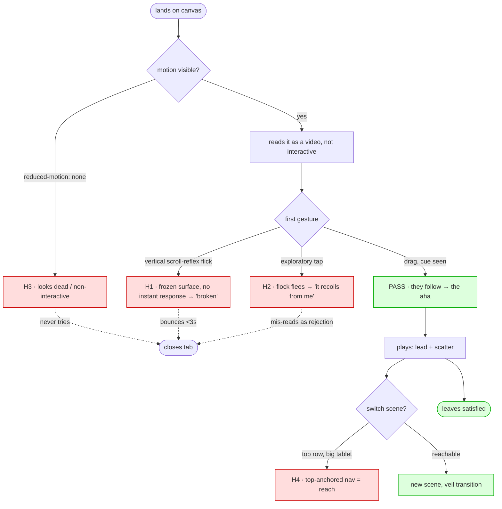

# User-Walkthrough Holes Report — Ink Flock on touch

**Lens:** user-walkthrough-lens
**Personas:** thumb-scroller (impatient mobile lander), lingerer (tablet explorer), sensitive-one (reduced-motion)
**Mode(s):** cold walkthrough + session-arc (single-session value materialisation; return-visit is thin for an ambient piece)
**Persona grounding tier:** 1.5 — research-grounded, pre-launch / incumbent-grounded (see persona-pack.md)
**Date:** 2026-07-16

## Executive summary

The design is fundamentally sound and the brief already anticipates the headline risk (the
discovery cliff). Walking it as real people surfaces three things the brief does **not** yet
resolve, all clustered on **familiarity transfer** and one sharp **cross-dependency**: (1) the
mobile visitor's *first* gesture is a scroll-reflex flick against a now-frozen surface, so the
first-touch cue must be a live response, not passive text; (2) if their first contact is a
*tap*, the flock *flees* — first impression becomes "it recoils from me," the opposite of the
intended agency; (3) the reduced-motion resolution removes idle-drift, which is the very
ambient motion that signals "this is alive and interactive" — so the sensitive visitor can land
on a page that looks dead. None are fatal; all are cheap to fix before build and change what
Op3 must implement.

## Journey map



## Findings — High severity

**H1 · First gesture is a scroll-reflex flick against a frozen surface (thumb-scroller · canvas)**
The mobile lander arrives with an Instagram/TikTok reflex: the first thing their thumb does on
a full-screen surface is a vertical flick to *scroll it away*. With `touch-action: none` the
page won't move — correct for the gesture, but if the flock doesn't visibly respond *on that
very first move*, the persona reads "frozen/broken," not "I'm leading them," and bounces in
seconds. Axis: familiarity transfer (tempo mismatch) + the documented gesture-discoverability
gap. **Implication for the brief:** the first-touch cue can't be passive prominent text — the
*flock's response* (and the ring under the finger) must be the affordance, firing on the first
`pointermove`, before any reading happens. [web + spec]

**H2 · First contact by tap makes the flock flee — reads as rejection (thumb-scroller · canvas)**
A cautious visitor's first probe is a *tap* ("does anything happen?"), not a confident drag.
Under the locked model a tap = scatter, so their first-ever interaction makes the whole flock
*recoil from them*. Before the "they follow me" relationship is established, "they flee from my
touch" is an emotional negative — the piece appears to reject the user at hello. Axis:
familiarity transfer (safety/emotional-model mismatch) + effort/reward timing. **Implication:**
consider making the *first* touch always read as attraction (lead), with scatter earning its
place only after the follow relationship exists — or make the scatter unmistakably playful, not
a flinch. This is an ordering decision the brief doesn't yet make. [inferred — put to the team:
should the very first touch ever scatter, or always lead?]

**H3 · Reduced-motion removes the motion that signals interactivity (sensitive-one · canvas)**
The brief's reduced-motion resolution is "interactive but no autonomy" — kill idle-drift, no
veil, reduced pace. Correct for comfort. But idle-drift *is* the ambient motion that makes a
casual visitor notice the piece is alive and worth touching. Remove it and the sensitive
visitor lands on a near-static image with no hover and no motion — nothing says "touch me," so
they may never interact at all. The two correct decisions (honour reduced-motion; rely on
ambient motion for discovery) collide. Axis: cold-start / discovery. **Implication:** under
reduced-motion, provide a *static* discovery affordance (a persistent, non-animated "drag —
they follow" cue or a single gentle one-shot hint) so interactivity is legible without
perpetual motion. [web + inferred]

## Findings — Medium severity

**H4 · Top-anchored mode switcher is a reach on large tablets (lingerer · header)**
The two-row header keeps nav at the top (right call — bottom is the play field). But a lingerer
holding a 10–11" tablet low/two-handed must stretch to the top row to switch scenes. Not
abandonment — friction that makes scene-switching feel less like part of the art. Axis:
familiarity transfer (tablet ergonomics). **Implication:** ensure ≥44px targets and verify
top-row reach at tablet size in Op4; a gesture-based scene switch (e.g. two-finger tap) could
supplement but adds another hidden gesture — probably not worth it. [spec + inferred]

**H5 · Global-target swing vs. direct-manipulation expectation (lingerer · canvas)**
The lingerer's tablet muscle memory (drawing/game apps) expects the *nearest* elements to react
locally to their finger. The boids target is global, so the whole flock swings toward the
touch. This can read as magical or as "loose/unresponsive" depending on arrive-radius tuning.
Axis: familiarity transfer (effort/response mismatch). **Implication:** a tuning question for
Op3/Op4, not a redesign — worth watching whether the swing feels intentional on a large
surface. [inferred]

## Findings — Low severity

**H6 · Scatter legibility on a small screen (thumb-scroller · canvas)**
On a 375px surface with a reduced agent count, a scatter burst has less visual mass than on
desktop and may under-read as a response. Tune scatter force/visibility for the scaled
viewport. [inferred]

## Patterns passed (what the design gets right)

- **Nav stays top, bottom stays clear for the gesture** — resolves the play-field-vs-bottom-nav
  collision correctly; the brief's tension 1 call holds up under the walk. [spec]
- **Teach-once-then-recede hint** — matches the onboard job; correct that it's non-blocking and
  self-dismissing rather than a coach-mark modal. [web]
- **Ring under the finger** — directly addresses the "make agency visible on touch" need; the
  single most important discovery move, and it's already in the brief. [web]
- **`s=1` at desktop** — the faithful-port guarantee means none of this risks the shipped
  desktop experience. [spec]
- **Reduced-motion honoured in the rAF loop, not just CSS** — the sensitive-one's core need is
  met at the right layer (the H3 caveat is about discovery, not comfort). [web]

## Remediation order (by adoption leverage)

1. **H1** — make the first-touch response *live* (flock + ring react on first `pointermove`),
   not passive text. This is the difference between discovery and a sub-3s bounce.
2. **H2** — decide the first-contact ordering (should the very first touch ever scatter?). A
   one-line rule change, high emotional leverage.
3. **H3** — add a static discovery affordance under reduced-motion. Cheap; unblocks a whole
   persona.
4. **H4/H5** — tablet reach + swing feel: verify and tune in Op3/Op4.
5. **H6** — scatter legibility at small scale: tune during build.

## Novelty diff (vs. interface-brief.md open questions)

- **H1 — SHARPENS-EXISTING.** The brief flags the discovery cliff and a first-touch cue; the
  walk adds *why passive text fails* — the first gesture is an exit-reflex flick against a
  frozen surface, so the response must be live.
- **H2 — NOVEL.** The brief nowhere addresses first-contact ordering or that tap-first reads as
  rejection. Genuine contribution.
- **H3 — NOVEL.** The brief treats reduced-motion (comfort) and discovery (ambient motion)
  separately; their collision is not noted anywhere. Genuine contribution.
- **H4 — SHARPENS-EXISTING** (brief open Q on tablet ergonomics/targets).
- **H5 — DUPLICATE** of the persona pack's locality-expectation trait; restated in journey terms.
- **H6 — SHARPENS-EXISTING** (brief's density-scaling open question).

## Confidence & what would raise it

H1 rests on well-documented mobile scroll-reflex and gesture-discoverability research [web] —
strong. H3 is web-grounded on the accessibility need and inferred on the discovery collision —
strong hypothesis worth building for. H2 is inferred: **put to the team — should the first
touch on a fresh load ever scatter, or always lead until the follow relationship exists?** H4/H5
are inferred ergonomics/tuning questions best answered by the Op4 device check with a real
finger on a real phone and tablet. One cold observation of a real person handed the build on a
phone would confirm or kill H1–H3 faster than any more analysis.
```
